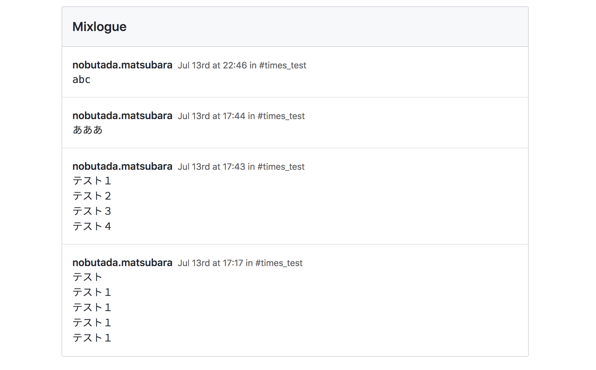

# mixlogue

mix monologue : collect messages from any public `times_xxx` channels in slack.

## USAGE

```
$ mixlogue --help
unrecognized option `--help'

mixlogue [options]
      --version         Show version
  -v  --verbose         Enable verbose mode: verbosity level "debug"
      --ls              Show target channels
      --update          Update local cache: slack channels
      --ts              Show setting start timestamp
      --before=TIME     Set what minutes ago to collect messages from
      --interval=TIME   Set interval second to collect messages
      --workspace=TEXT  Set slack workspace name for link
```

## Example

```
$ SLACK_TOKEN=yyy gdmixlogue --before=300 --workspace=hoge
Please accsess to localhost:8080
...
```

Accsess to localhost:8080 by Browser:



## Build

using Haskell Stack and Elm:

```
$ stack test
```
